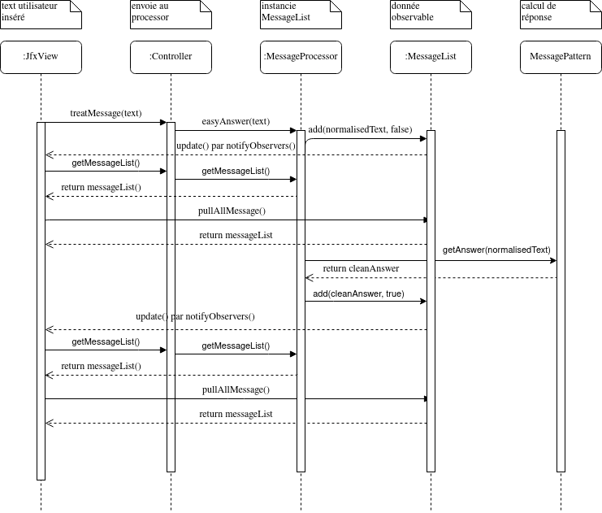
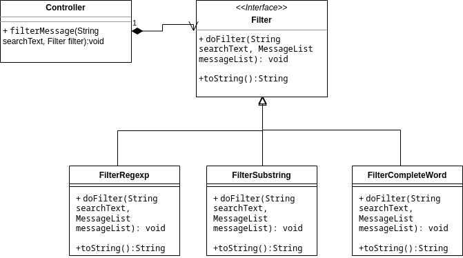
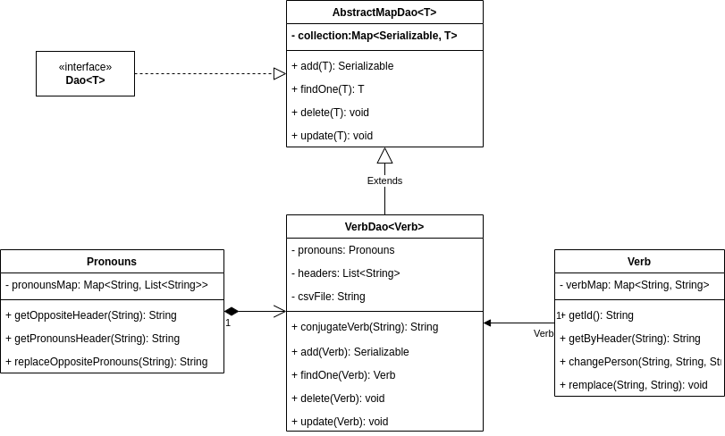
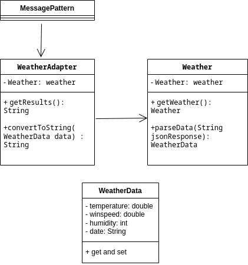
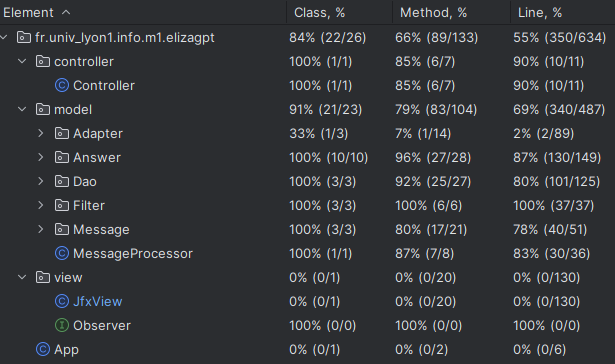

<!-- Votre rendu inclura un rapport, au format PDF (consignes pour le rendu
ci-dessous), qui doit comprendre obligatoirement :

une présentation globale du projet (rapide : ne répétez pas
l'énoncé), -->
# **Le projet ELIZA-GPT 2023**
- Arthur Desbiaux, P2006393
- Valentin Cuzin-Rambaud, P2003442

**Sommaire**
- [Présentation](./Rapport.md#i-présentation-du-projet)
- [Principe GRASPS](./Rapport.md#ii-principe-grasps)
- [Design Patterns](./Rapport.md#iii-design-patterns)
- [Ethique](./Rapport.md#iv-ethique-dans-lia)
- [Tests](./Rapport.md#v-tests)
- [Bibliographie](./Rapport.md#vi-bibliographie)

## I. Présentation du projet
Ce projet se déroule dans le cadre de l'UE Gestion de projet. On y aborde la thématique de l'IA en recodant l'une des premières IA conversationnel eliza-gpt. Le projet est de réaliser un chatbot qui permet d'avoir des discutions avec réponses multiples, situationnels. Tout cela en respectant une norme de struture de code et une rigeur jamais vu auparavant, notament en utilisant l'architecture MVC, en appliquant les principes de GRASPS et en utilisant des Design patterns...

## II. Principe GRASPS
Parmis touts les principes GRASPS[[1]](./Rapport.md#1-httpsenwikipediaorgwikigrasp_object-oriented_design) nous essayons au mieux de respecter le faible couplage, notamment avec la classe MessagePattern qui permet de rajouter facilement des messages prédéfini dans la logique. De plus avec le package SelectAnswer, on respecte le polymorphism, avec le type générique T. Les principes GRASPS permettent de généraliser son code, pour faciliter le développement du code, l'ajout de nouvelle fonctionnalitées, la ré-utilisation, surtout dans un cycle de projet SCRUM.

<!--
Une section « design patterns », donnant une motivation des choix
d’architecture (et des patterns choisis), et leur explication en s’aidant de
diagrammes appropriés et adaptés au degré de précision et au type
d’explication. Donc des diagrammes de classe, mais pas que cela, et pas de
plats de spaghettis générés automatiquement représentant tout le code.
-->

## III. Design Patterns

### **0. MVC**
Le projet est structuré avec l'architecture MVC[[2]](./Rapport.md#2-httpsenwikipediaorgwikimodel–view–controller) afin de séparer la logique métier de l'affichage, qui réduit notre couplage (principe de GRASP). Nous avons fais une implémentation pull-based, c'est à dire que la vue tire de l'information de la donnée généré par le model. La vue observera les changements dans le model (observé), c'est l'utilisation du design Patterns Observer[[3]](./Rapport.md#3-httpsenwikipediaorgwikiobserver_pattern). Cela permet par exemple de synchroniser nos vues.

### Diagramme de la sequence d'envoie d'un message utilisateur, jusqu'au retour de la list de message rempli

<!--explications sur diagramme-->

### **1. Stratégie**
Nous avons décidé d'utiliser Stratégie[[4]](./Rapport.md#4-httpsenwikipediaorgwikistrategy_pattern) pour la réalisation de nos filtres. Nous voulions manipuler un objet Filtre qui s'instancie avec le bon filtre à utiliser (regex, complete word, sub-string). Stratégie est parfait dans ce cas d'utilisation car il permet le changement dynamique de comportement de l'objet.

Voila comment nos filtres sont appelé, depuis la vue on récupère le filtre que l'utilisateur utilise. Lorsqu'on veut appliquer la recherche, on utilise donc Filter comme objet qui va ensuite utiliser la bonne méthode de filtre.
Chaque Filtre est un extends de l'interface Filter qui possède deux méthodes, une pour afficher correctement le nom du filtre et l'autre qui va trier la liste de message (et donc la modifier).

### **2. DAO**
L'utilisation de DAO[[5]](./Rapport.md#5-httpsenwikipediaorgwikidata_access_object) pour la conjugaison des verbes permet d'implémenter l'accès à un dictionnaire en synchronisant avec un fichier de configuration. Ainsi, le fichier de configuration peut être modifier à partir du code, pour rajouter, modifier, supprimer des verbes. On peut aussi charger un autre fichier de configuration par exemple si on veux conjuger des verbes en anglais. Le Dao implémenté nous permet ainsi une configuration persistante et complémente le modèle MVC en séparrant encore plus la donnée du modèle.

### Diagramme des classes pour Dao et la gestion de la conjugaison

Nous avons repris le code de Lionel Médini afin de partir sur un Dao propre. on extends la classe VerbDao pour ré-écrire le CRUD (Creator, Read, Update, Delete) afin de gérer à la fois le fichier de configuration et la map. Pour le csv nous utilisons la biliothèque *commons-csv de apache*. la fonction ConjugateVerb cherche dans la phrases les verbes conjuguées dans le temps 1 puis les remplaces par le temps 2 en accedant à la collection de Verb.

### **3. Adaptateur**
L'Adaptateur[[6]](./Rapport.md#6-httpsenwikipediaorgwikiadapter_pattern) à été utilisé pour implémenter la météo. Lorsque nous voulons faire des requêtes sur l'api de météo, il faut pouvoir récupérer les données et les transformer pour les utiliser.

Pour l'implémenter, nous avons tout d'abord fait une classe qui possèdera toute nos data sur la météo. Ensuite nous avons une classe Weather qui a une fonction pour faire la requête sur l'api et une autre fonction pour parser correctement nos données. La classe WeatherAdapter quand ta elle se contente de récupérer la réponse de la rêquete (une instance de WeatherData) et de l'afficher sous forme de String pour l'utilsateur

<!--
Une section « éthique ». Cette section devra discuter de la problématique des
IA conversationnelles comme ChatGPT, Bard, etc. Quels sont les
enjeux ? Quels sont les risques et les bénéfices, pour la société qui édite un
tel programme, et pour ses utilisateurs ? Quelles sont les mesures, légales et
techniques, pour limiter ou éliminer les risques ? Lesquels sont mis en œuvre
dans la réalité ? En avez-vous mis en place dans votre TP, si oui, lesquelles
(il s'agit d'un petit projet scolaire, on ne vous demande pas une application
vraiment sécurisée, mais vous devriez être capable de discuter des limites de
votre implémentation. Vous pouvez aussi mettre en place des mesures simplistes
et discuter de ce qu'il faudrait faire dans une vraie application) ?
L'objectif n'est pas de donner un avis subjectif (la question «
ChatGPT/Bard/... est-il bien ? » est hors sujet ici), mais de présenter les
questions importantes et les éléments objectifs de réponse autour de la
question des IA conversationnelles. Appuyez-vous autant que possible sur des
articles existants, en citant vos sources. Il s'agit donc avant tout d'un
travail de bibliographie de votre part.
Pour vous aider, voici quelques références intéressantes sur le sujet :

ChatGPT et Bard sur Wikipedia

Sept choses à savoir sur la suspension de ChatGPT en Italie
-->

Quels sont les enjeux ? 

- Violation de donnée (RGPD) afin du deep lerning.
- Parler à son meilleur pote faut faire gaffe.
- Information fausse, prise comme vrai. 

Quels sont les risques et les bénéfices, pour la société qui édite un tel programme, et pour ses utilisateurs ? 

- Pour les utilisateur on a du temps à gagné sur une recherche google, et une information bien expliqué, au risque qu'elle soit fausse.
- Pour la société, c'est l'argent biensûr mais surtout la donnée utilisateur afin d'améliorer son chatbot et donc faire plus d'argent, au risque juridique de ne pas respecter la loi.

Quelles sont les mesures, légales et techniques, pour limiter ou éliminer les risques ?
- Besoin de temps et de reflexion pour éviter de faire n'importe quoi comme dit elon Musk.
- Bien montrer au acteur de l'IA que la question éthique est importante comme en italie.
- Faire comprendre au gens ce que c'est que l'IA avec de la transparence et des réponse claire quand on demande à l'IA ce qu'il est quitte à être froid.

Lesquels sont mis en œuvre dans la réalité ?

<!--
Un ingénieur de Google mis à pied après avoir affirmé que l’intelligence artificielle était "sensible"

Un Belge se suicide après avoir trouvé refuge auprès d'un robot conversationnel

Prompt engineer : quel est ce nouveau métier qui rapporte jusqu’à 300 000 € ?

Elon Musk et des centaines d’experts réclament une « pause » dans le développement de l’intelligence artificielle

ChatGPT est-il devenu plus “éthique” grâce à l’exploitation de travailleurs kényans ?

La liste n'est bien entendu pas exhaustive. Pensez à vos enseignants qui
liront des dizaines de rapports, surprenez-nous, apprenez-nous des choses ! Si
votre relecteur se dit « Ah tiens, je ne savais pas » ou « Ah tiens, je n'y
avais pas pensé » en lisant votre rapport, vous avez atteint l'objectif !
Vous pouvez utiliser une IA conversationnelle pour écrire cette section, mais
si vous le faites vous devez le dire explicitement dans votre rapport et
donner les requêtes (prompt) que vous avez utilisé pour arriver au texte
final.-->
## IV. Ethique dans l'IA

<!--
Une section « tests » où vous décrirez les tests manuels que vous avez
réalisés. Vos tests automatiques (le code Java des tests et les commentaires
associés) devraient se suffire à eux-mêmes, il n'est pas nécessaire de les
re-documenter dans le rapport (sauf si vous avez fait des choses
extraordinaires qui méritent une documentation externe).
-->
## V. Tests
Nous avons fait des test par cas d'utilisations pour vérifier le bon fonctionnement de l'application.
Par exemple avec nos deux vues, on a pu vérifier que notre MVC pull-based fonctionne bien car les vues sont synchronisées. Lorsque l'on ajoute/supprime un message, l'affichage se met à jour sur les 2 vues. Cela fonctionne également de la même manière lors de l'application du filtre.

Pour l'interface utilisateur, on s'est assuré que le changement de mode dark/light fonctionne correctement., et que la structure de la fenêtre nous conviennent.

Pour la création de nos test automatique, nous avons fait en sorte de couvrir le plus de code:

<!--
On vous demande d'appuyer votre rapport sur des références bibliographiques existantes, mais il ne s'agit en aucun cas de vous contenter de copier-coller. Il est rappelé ici que le droit de courte citation impose entre autres de citer vos sources quand vous utilisez un extrait d'un texte existant (il est interdit, pas seulement dans le cadre d'un travail scolaire, de laisser entendre que vous êtes l'auteur d'un texte que vous n'avez pas écrit vous-même). -->

## VI. bibliographie

#### 1. https://en.wikipedia.org/wiki/GRASP_(object-oriented_design)
#### 2. https://en.wikipedia.org/wiki/Model%E2%80%93view%E2%80%93controller
#### 3. https://en.wikipedia.org/wiki/Observer_pattern
#### 4. https://en.wikipedia.org/wiki/Strategy_pattern
#### 5. https://en.wikipedia.org/wiki/Data_access_object
#### 6. https://en.wikipedia.org/wiki/Adapter_pattern